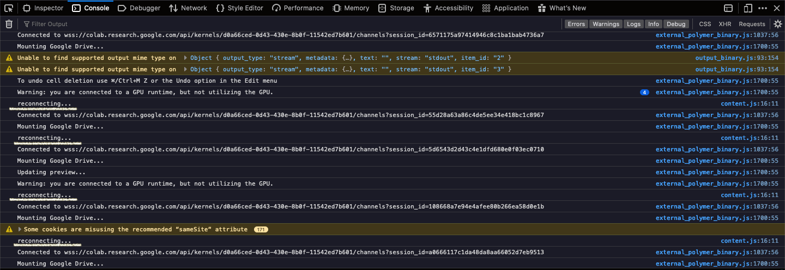

# Colab Auto Reconnect 

**Version** : 1.1.0

**To be Released** : July 10th, 2020 (tentative)

Chrome WebStore Link : [CoAuRe](https://chrome.google.com/webstore/detail/colab-auto-reconnect/nbcihfbfamjlfiopdcemmohoojdecjid)

GitHub Pages : [CoAuRe](https://zohebabai.github.io/Colab_Auto_Reconnect/)

**Are you a budding Data Scientist?**

**Love to use free resources?**

**Require GPU for your Deep Learning projects?**

If 'Yes', then you must be using Google Colab Jupyter Notebook with free GPU and TPU services. And if you are an admirer of Colab (like me), then you must be depending a lot on Colab Notebooks. 

Everything's Good about Colab, except one thing. It gets disconnected a lot and you need to manually click the button to reconnect continue running the session. This is annoying for a data scientist, as you can't babysit your session for 12 hours. So this chrome extension **CoAuRe** comes to your rescue.

**Colab Auto Reconnect**  
1. Automatically reconnects your ongoing session whenever it gets disconnected without any manual intervention. Now you can go for a good night's sleep without bothering about your Colab session getting disconnected for the next 12 hours. 
2. Comes with an inbuilt timer, which can be used for getting notified (Alert with Sound) when your tasks gets over, especially during end of your Model Training at Colab.

**To Check If it's working, do the following:**
1. Click Option + ⌘ + J (on macOS), or Shift + CTRL + J (on Windows/Linux) to open Chrome Dev Console.
2. If you see 'reconnecting...' at the bottom, that means it's working. It should look something like this:

*It would be my pleasure if a developer like you contributes to this project.*

*If this free chrome extension helped you, then please give good ratings at Chrome Web Store.*
