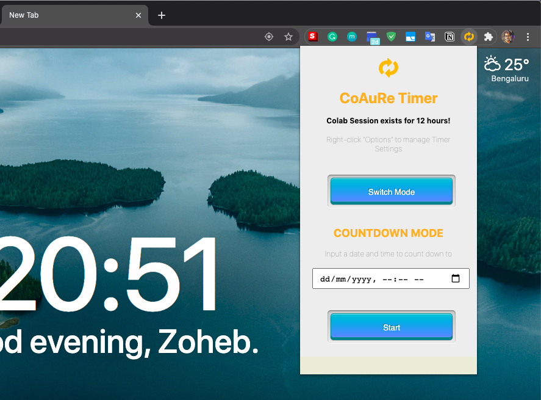

# Colab Auto Reconnect 

| :exclamation:  The author no more maintains the extension and repository. |
|-----------------------------------------|

| Chrome | Firefox |
| :----: | :----: |
| | |
| **Version** : 1.1.0 | **Version** : 1.1.1 |
| **Debut** : July 25th, 2019 | **Debut** : July 4th, 2020 |
| **Final Update** : July 4th, 2020 | **Final Update** : May 11th, 2021 |
| Google Chrome WebStore Link : [CoAuRe](https://chrome.google.com/webstore/detail/colab-auto-reconnect/nbcihfbfamjlfiopdcemmohoojdecjid) | Mozilla Firefox Addon Link : [CoAuRe](https://addons.mozilla.org/en-US/firefox/addon/colab-auto-reconnect/) |

**Are you a budding Data Scientist?**

**Love to use free resources?**

**Require GPU for your Deep Learning projects?**

If 'Yes', then you must be using Google Colab Jupyter Notebook with free GPU and TPU services. And if you are an admirer of Colab (like me), then you must be depending a lot on Colab Notebooks.

Everything's Good about Colab, except one thing. It gets disconnected a lot and you need to manually click the button to reconnect continue running the session. This is annoying for a data scientist, as you would not prefer to babysit your session for 12 hours. So this chrome/firefox extension **CoAuRe** comes to your rescue.

**Colab Auto Reconnect**  
1. Automatically reconnects your ongoing session whenever it gets disconnected without any manual intervention. Now you can go for a good night's sleep without bothering about your Colab session getting disconnected for the next 12 hours.
2. Chrome Extension comes with an inbuilt timer, which can be used for getting notified (Alert with Sound) when your task gets over, especially at the end of your Model Training on Colab.

**To Check If it's working, do the following:**
1. Click Option + ⌘ + J (on macOS), or Shift + CTRL + J (on Windows/Linux) to open Chrome Dev Console.
2. If you see 'reconnecting...' at the bottom, that means it's working. It should look something like this:

**Thank you for all the support!**

*If this free chrome/firefox extension helped you, then please leave good ratings at Web/AddOns Store.*
